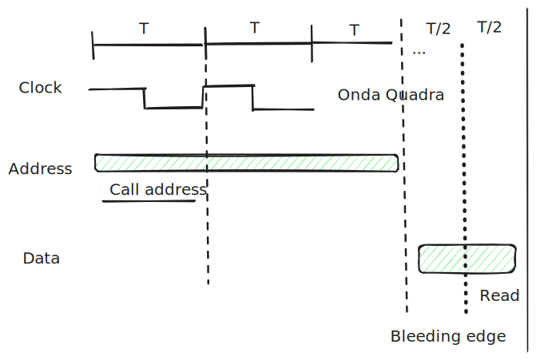

# Bus

Seconda Prova parziale 2019
 

> Si consideri un bus sincrono che lavora a $`50 Mhz `$ con linee separate per dati e
> indirizzi dotato dei segnali di controllo MREQ, RD e WAIT e una memoria con un tempo di
> risposta di $`80 nsec`$ dal momento in cui gli indirizzi sono stabili.

[Diagramma di Temporizzazione](./excalidaws/Diagramma_di_Temporizzazione.excalidraw)

 

Domande:
 

>a) In condizioni ideali, per quanto tempo deve essere asserito il segnale di WAIT per garantire una lettura in memoria? 
>Esprimere il risultato con un numero che indica il tempo in nsec.

Soluzione
 

>$`T = 1/ (5*10^7) = 20nsec`$ - `Il periodo è 20nsec`.
>
>Il primo periodo è occupato dalla richiesta del `Address`
>
>Il `wait` è asserito dopo il primo periodo fino al inizio del periodo della lettura del dato. 
>
>Perciò: $`80nsec - 20nsec = 60nsec`$ è il tempo del `wait asserito`.

>b) In condizioni ideali, dopo quanto tempo i dati saranno disponibili presso il master?
>Esprimere il risultato con un numero che indica il tempo in nsec.

Soluzione
 

>$`80nsec + T/2 = 90nsec`$

>c) In condizioni ideali, quanto dura, complessivamente, una transazione di lettura? Esprimere il risultato con un numero che indica il tempo in nsec.

Soluzione
 

>$`80nsec + T `$(Ciclo di lettura) $`= 100nsec`$

>d) In condizioni ideali, quanto dura, complessivamente, una transazione di lettura se la
>frequenza si dimezza? Esprimere il risultato con un numero che indica il tempo in nsec.

Soluzione
 

>$`80nsec + 2*T = 120nsec`$ 

